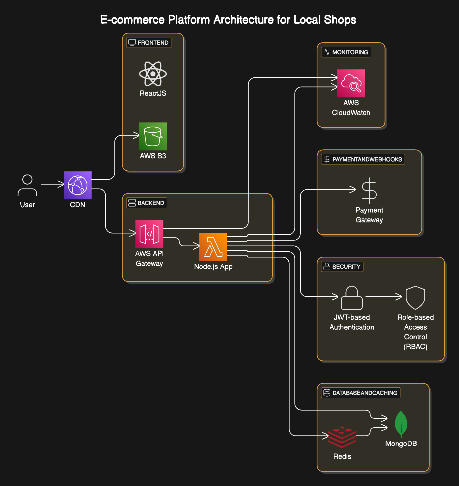

# Microservices E-commerce with AWS Serverless Express

This README outlines the steps to configure and deploy your Microservices-based E-commerce project. The project uses `aws-serverless-express` for different microservices and a React frontend hosted on S3 with CloudFront for content delivery. Only CloudFront's origin must be allowed for security, as `credentials: true` is set.

---

## Architecture Diagram



---

## Microservices Setup

### Endpoints
The following endpoints are configured as proxies, each with a separate AWS Lambda function:

- `/api/auth`
- `/api/admin`
- `/api/shop`
- `/api/common`

These endpoints are set up as API Gateway resources, with respective Lambda integrations.

### Steps to Deploy Microservices

1. **Prepare Lambda Functions**:
   - Create separate AWS Lambda functions for each endpoint.
   - Use `aws-serverless-express` to handle Express.js routing.

2. **API Gateway Configuration**:
   - **Create an API Gateway**:
     - Go to the AWS Management Console and navigate to API Gateway.
     - Create a new REST API and give it a suitable name.
   
   - **Define Resources and Methods**:
     - Add resources for each endpoint (`/api/auth`, `/api/admin`, `/api/shop`, `/api/common`).
     - For each resource, create appropriate HTTP methods (e.g., GET, POST).

   - **Integrate with Lambda**:
     - Configure each method to integrate with its corresponding Lambda function.
     - Use Lambda Proxy Integration to pass requests directly to your Express app.

   - **Enable CORS**:
     - Go to the method settings and enable CORS.
     - Allow only the CloudFront origin in the allowed origins.
     - Set allowed headers, methods, and credentials as required.

   - **Deploy the API**:
     - Create a new stage (e.g., `prod`) and deploy the API.

   - **Test the Setup**:
     - Use Postman or curl to test the endpoints.

---

## Setting Up MongoDB

### Steps

1. **Create a MongoDB Cluster**:
   - Use MongoDB Atlas or deploy a MongoDB cluster on a cloud provider (e.g., AWS EC2).

2. **Get Connection URI**:
   - Obtain the connection URI for your MongoDB instance.

3. **Integrate in Microservices**:
   - Add the connection URI to environment variables (`MONGODB_URI`).

---

## Setting Up Cloudinary

### Steps

1. **Create a Cloudinary Account**:
   - Sign up at [Cloudinary](https://cloudinary.com/).

2. **Get API Credentials**:
   - Obtain the `CLOUDINARY_CLOUD_NAME`, `CLOUDINARY_API_KEY`, and `CLOUDINARY_API_SECRET` from your Cloudinary dashboard.

3. **Integrate in Microservices**:
   - Add the Cloudinary credentials to environment variables.

---

## Setting Up PayPal

### Steps

1. **Create a PayPal Developer Account**:
   - Sign up at [PayPal Developer](https://developer.paypal.com/).

2. **Create an App**:
   - Create a new app in the PayPal Developer Dashboard.
   - Obtain the `PAYPAL_CLIENT_ID` and `PAYPAL_SECRET`.

3. **Set PayPal Mode**:
   - Use `sandbox` for testing and `live` for production.
   - Add `PAYPAL_MODE` to environment variables.

---

## Setting Up Redis

### Steps

1. **Deploy Redis**:
   - Use AWS Elasticache or deploy Redis on an EC2 instance.

2. **Integrate in Microservices**:
   - Add the Redis connection URL to environment variables (`REDIS_URL`).

---

## React Frontend Deployment

### Build and Deploy to S3

1. **Install Dependencies**:
   ```bash
   npm install
   ```

2. **Build the Project**:
   ```bash
   npm run build
   ```

   This generates a `build/` directory with the static assets.

3. **Upload to S3**:
   - Create an S3 bucket to host the frontend.
   - Upload the contents of the `build/` directory to the S3 bucket.
   - Enable static website hosting on the S3 bucket.

4. **Set Bucket Permissions**:
   - Restrict public access to the bucket.
   - Use a bucket policy to allow only CloudFront access.

   Example Bucket Policy:
   ```json
   {
       "Version": "2012-10-17",
       "Statement": [
           {
               "Effect": "Allow",
               "Principal": {
                   "Service": "cloudfront.amazonaws.com"
               },
               "Action": "s3:GetObject",
               "Resource": "arn:aws:s3:::YOUR_BUCKET_NAME/*",
               "Condition": {
                   "StringEquals": {
                       "AWS:SourceArn": "arn:aws:cloudfront::YOUR_ACCOUNT_ID:distribution/YOUR_DISTRIBUTION_ID"
                   }
               }
           }
       ]
   }
   ```

### Configure CloudFront

1. **Create CloudFront Distribution**:
   - Set the S3 bucket as the origin for static assets.
   - Enable caching for static assets.

2. **Add API Gateway as Backend Origin**:
   - Add an origin for the API Gateway endpoint in the CloudFront distribution.
   - Create a behavior for `/api/*` to route traffic to the API Gateway origin.

3. **Restrict Origins**:
   - Allow only the CloudFront distribution to access the S3 bucket.

4. **Enable HTTPS**:
   - Attach an SSL certificate using AWS Certificate Manager (ACM).

5. **Update React Configuration**:
   - Ensure the React application points to the CloudFront domain for API calls and assets.

---

## Environment Variables

Add the following environment variables to your microservices configuration:

```env
PORT=5000

MONGODB_URI=

CLOUDINARY_CLOUD_NAME=
CLOUDINARY_API_KEY=
CLOUDINARY_API_SECRET=

PAYPAL_CLIENT_ID=
PAYPAL_SECRET=
PAYPAL_MODE=

REDIS_URL=
```

---

## Security

- **CORS Configuration**:
  - Ensure CORS is restricted to the CloudFront origin.
  - API Gateway should allow credentials (`credentials: true`).

- **IAM Roles and Policies**:
  - Grant Lambda functions the necessary permissions to access other AWS services (e.g., DynamoDB, S3).
  - Restrict S3 access to CloudFront only.

---

## Final Notes

- Test the entire setup end-to-end.
- Monitor logs in CloudWatch for debugging.
- Use AWS X-Ray for tracing requests across services.

---

This configuration ensures a secure and scalable e-commerce platform leveraging AWS Serverless architecture.

